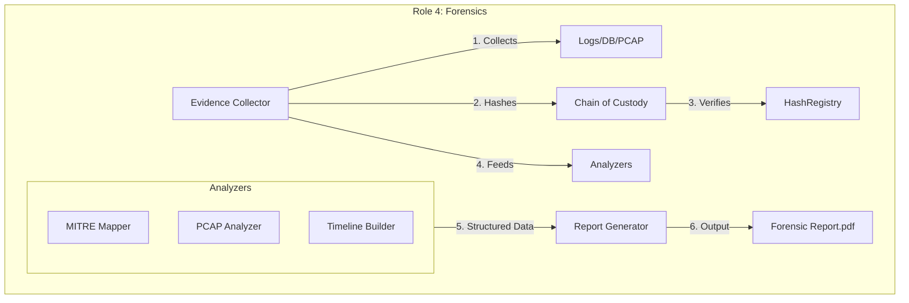
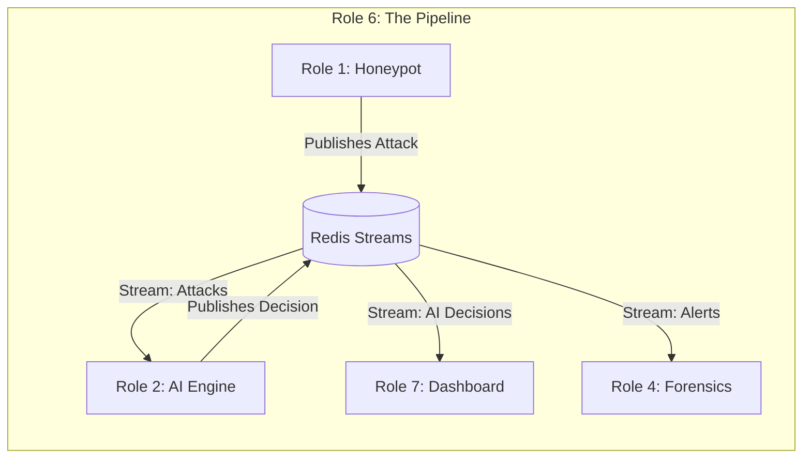

# Cyber Mirage: Deep Dive into Role 4 & Role 6

This document provides a comprehensive technical analysis of **Role 4 (Forensics)** and **Role 6 (Pipeline/Message Queue)** within the Cyber Mirage architecture.

---

# 🕵️ Role 4: Digital Forensics Engineer

## Overview
**Role 4** acts as the automated "Digital Detective" of the system. While other roles focus on real-time deception, Role 4 is responsible for **post-mortem analysis**, **legal defensibility**, and **evidence preservation**. Its primary goal is to transform raw attack data into court-admissible forensic evidence following international standards (NIST SP 800-86).

## 📂 Created Files & Directory Structure
The work of Role 4 is encapsulated in `src/forensics/`:

| File | Purpose |
|------|---------|
| `evidence_collector.py` | **The Core Orchestrator**. Sweeps logs, DBs, and memory to gather artifacts. |
| `chain_of_custody.py` | **The Legal Notary**. Manages evidence integrity, hashing, and audit trails. |
| `mitre_attack_mapper.py` | **The Profiler**. Maps technical actions to MITRE ATT&CK TTPs. |
| `pcap_analyzer.py` | **The Network Analyst**. Dissects raw network traffic (PCAP) for anomalies. |
| `timeline_builder.py` | **The Historian**. Merges disparate data sources into a chronological story. |
| `report_generator.py` | **The Stenographer**. Generates professional PDF/JSON reports for humans/machines. |
| `log_collector.py` | **The Archivist**. Centralizes and compresses logs from all containers. |

## 🧩 Detailed Code Analysis

### 1. Chain of Custody (`chain_of_custody.py`)
This is the most critical component for legal validity. It implements an **immutable audit trail**.

*   **Hashing**: Every time evidence is touched, its hash (SHA-256) is recalculated.
*   **Sealing**: Evidence is "sealed" after collection to prevent tampering.
*   **Verification**: The `verify_integrity()` function compares current on-disk hashes with the original collection hash.

```python
# Key Logic: Integrity Verification
def verify_integrity(self, evidence_id: str) -> Dict[str, Any]:
    evidence = self.evidence_items[evidence_id]
    # Calculate fresh hash of the file on disk
    actual_hash = self._calculate_hash(evidence.file_path)
    
    # Compare with the immutable original hash
    if actual_hash == evidence.original_hash:
        return {"status": "INTACT", "valid": True}
    else:
        # CRITICAL: Evidence has been tampered with!
        return {"status": "COMPROMISED", "valid": False}
```

### 2. Evidence Collector (`evidence_collector.py`)
This script interfaces with the entire infrastructure to pull data.

*   **Docker Integration**: Uses `subprocess` to run `docker logs` and capture attacker commands.
*   **Database Dump**: Connects to PostgreSQL to export the `attack_sessions` table.
*   **Redis Snapshot**: Dumps volatile memory from Redis to capture the "state of mind" of the AI at the time of attack.

### 3. MITRE Mapper (`mitre_attack_mapper.py`)
Translates raw commands into intelligence.

*   **Pattern Matching**: Scans for keywords like `wget`, `union select`, `shadow`.
*   **Mapping**:
    *   `wget` -> **T1105 (Ingress Tool Transfer)**
    *   `cat /etc/shadow` -> **T1003 (OS Credential Dumping)**
    *   `rm -rf` -> **T1485 (Data Destruction)**

## 📊 Workflow Diagram (Role 4)



---

# ⚡ Role 6: Pipeline & Orchestration (Message Queue)

## Overview
**Role 6** is the **"Nervous System"** of Cyber Mirage. It connects all other roles together using **Redis Streams**. Without Role 6, the system would be a collection of isolated components. It ensures that when a Honeypot detects an attack, the AI knows immediately, the Dashboard updates instantly, and Forensics starts recording.

## 📂 Created Files & Directory Structure
The work of Role 6 is encapsulated in `src/pipeline/`:

| File | Purpose |
|------|---------|
| `message_queue.py` | **The Nervous System**. Implements the Redis Streams wrapper, producer/consumer logic. |
| `__init__.py` | Exports the clean API for other roles to use. |

## 🧩 Detailed Code Analysis

### 1. Message Queue Manager (`message_queue.py`)
This is a robust, production-grade wrapper around Redis Streams. It handles the complexity of asynchronous communication.

*   **Streams**: Defines specific channels for different types of data:
    *   `stream:attacks`: Raw attack events from honeypots.
    *   `stream:ai_decisions`: What the AI decided to do.
    *   `stream:alerts`: Critical security warnings.
    *   `stream:forensics`: Triggers for evidence collection.

*   **Consumer Groups**: Allows multiple services to process the same stream without duplicating work (load balancing).
    *   Example: `group:ai_processor` reads from `stream:attacks`.

*   **Reliability**: Implements **Dead Letter Queues (DLQ)**. If a message fails to process 3 times, it's moved to a special queue for manual inspection, preventing the system from crashing on bad data.

```python
# Key Logic: Publishing an Event
def publish_attack_event(self, attacker_ip, service, action, details):
    payload = {
        'event_type': 'attack',
        'attacker_ip': attacker_ip,
        'service': service,
        'action': action,
        'timestamp': datetime.now().isoformat()
    }
    # Writes to Redis Stream "stream:attacks" with High Priority
    return self.publish(StreamName.ATTACK_EVENTS, payload, MessagePriority.HIGH)
```

```python
# Key Logic: Consuming with Retry
def start_consumer(self, stream, group):
    while self._running:
        # Read new messages
        messages = self.consume(stream, group)
        for msg in messages:
            success = self._process_message(msg)
            if success:
                # Tell Redis we finished this message
                self.acknowledge(stream, group, [msg.message_id])
            else:
                # If failed too many times, move to Dead Letter Queue
                if msg.retry_count >= msg.max_retries:
                    self._move_to_dlq(msg)
```

## 📊 Workflow Diagram (Role 6)



## 🤝 Interaction Between Role 4 and Role 6

The relationship between these two roles is critical:

1.  **Trigger**: Role 6 (Pipeline) carries the `stream:alerts` message saying "CRITICAL ATTACK DETECTED".
2.  **Action**: Role 4 (Forensics) subscribes to this stream. When it sees a critical alert, it **wakes up**.
3.  **Collection**: Role 4 immediately triggers `evidence_collector.py` to snapshot the state of the system *before* the attacker disconnects.
4.  **Reporting**: Once Role 4 generates a report, it publishes a message back to Role 6 on `stream:forensics` saying "Report Ready", which the Dashboard (Role 7) then displays to the user.

---

## 📝 Summary of Responsibilities

| Feature | Role 4 (Forensics) | Role 6 (Pipeline) |
|---------|-------------------|-------------------|
| **Primary Goal** | Evidence & Legal Proof | Communication & Speed |
| **Key Technology** | Hashing, PDF Generation | Redis Streams, Async IO |
| **Data Persistence** | Long-term (Files/DB) | Short-term (Buffer/Queue) |
| **Reaction Time** | Post-Incident (Minutes) | Real-Time (Milliseconds) |
| **Output** | Reports, Timelines | Events, Triggers |

This architecture ensures Cyber Mirage is both **fast** (thanks to Role 6) and **accountable** (thanks to Role 4).
