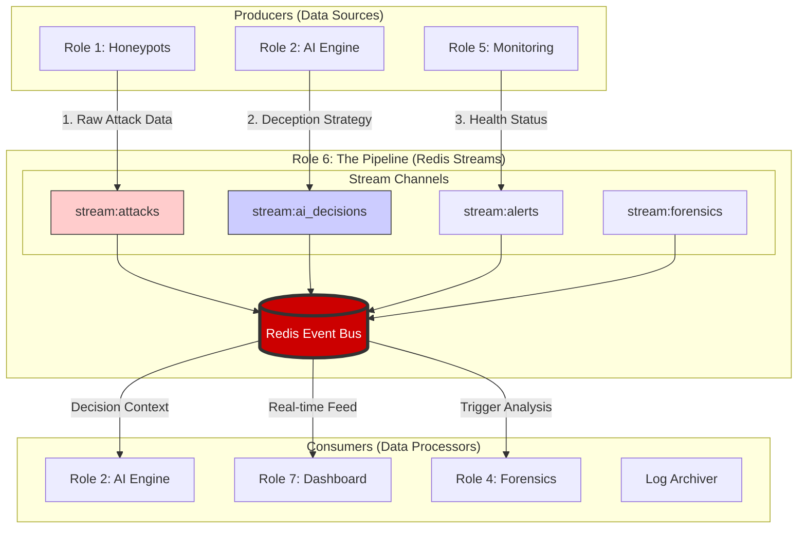
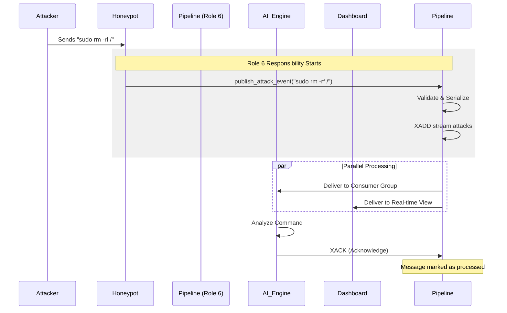

# Role 6: Data Pipeline & Orchestration Architecture
## PhD Defense Technical Documentation

---

## 1. Executive Summary
**Role 6** serves as the **Central Nervous System** of the Cyber Mirage architecture. In a distributed system comprising AI agents, honeypots, and forensic analyzers, direct point-to-point communication leads to tight coupling and system fragility. Role 6 solves this by implementing an **Event-Driven Architecture (EDA)** using **Redis Streams**.

This role is responsible for ensuring that every event—whether it's an attacker typing a command, an AI agent making a decision, or a system alert—is delivered reliably, asynchronously, and in real-time to all interested components.

### Key Contributions
*   **Decoupling**: Honeypots do not need to know about the AI Engine; they simply publish events to the pipeline.
*   **Reliability**: Implementation of **Dead Letter Queues (DLQ)** ensures zero data loss even during component failures.
*   **Scalability**: Support for **Consumer Groups** allows multiple AI agents to process high-volume attack streams in parallel.
*   **Persistence**: Unlike standard Pub/Sub, the stream architecture persists events to disk, allowing for replayability and forensic auditing.

---

## 2. System Architecture

The following diagram illustrates the pivotal position of Role 6 within the Cyber Mirage ecosystem. It acts as the intermediary layer that facilitates all inter-service communication.



---

## 3. Detailed Responsibilities

### 3.1. Event Bus Management
Role 6 is responsible for the lifecycle of all message streams. This includes:
*   **Stream Creation**: Initializing `stream:attacks`, `stream:ai_decisions`, etc.
*   **Retention Policy**: Managing memory usage by trimming streams (e.g., keeping only the last 100,000 events) to prevent memory overflows in the Redis instance.
*   **Serialization**: Enforcing JSON serialization for all payloads to ensure interoperability between Python services.

### 3.2. Reliability Engineering
In a security context, losing data is unacceptable. Role 6 implements robust fault tolerance mechanisms:
*   **Acknowledgments (ACK)**: Consumers must explicitly acknowledge that they have successfully processed a message. If a consumer crashes mid-processing, the message remains "pending".
*   **Retry Logic**: The system automatically redelivers pending messages to healthy consumers.
*   **Dead Letter Queue (DLQ)**: If a message fails to process after 3 retries (e.g., due to a malformed payload), it is moved to a `stream:dead_letter` for manual inspection, preventing the pipeline from getting stuck.

### 3.3. Scalability & Load Balancing
To handle high-intensity DDoS attacks, Role 6 utilizes **Consumer Groups**:
*   Multiple instances of the AI Engine can join the `group:ai_processor`.
*   Redis automatically distributes incoming messages across these instances.
*   This allows the system to scale horizontally simply by adding more AI containers.

---

## 4. Code Analysis & Implementation

The core logic is encapsulated in `src/pipeline/message_queue.py`. Below is a detailed breakdown of the critical components.

### 4.1. The `Message` Data Structure
To ensure type safety and consistency, all events are wrapped in a `Message` dataclass.

```python
@dataclass
class Message:
    message_id: str          # Unique UUID for tracking
    stream: str              # The channel (e.g., stream:attacks)
    payload: Dict[str, Any]  # The actual data content
    priority: int            # Priority level (1-4)
    timestamp: str           # ISO-8601 timestamp
    producer_id: str         # Who sent this?
    retry_count: int = 0     # How many times have we tried to process this?
```

### 4.2. The `MessageQueueManager` Class
This is the main interface for the system. It follows the **Singleton Pattern** to ensure a single connection pool is used throughout the application.

#### Publishing Events
The `publish` method handles the complexity of connecting to Redis and serializing data.

```python
def publish(self, stream: StreamName, payload: Dict, priority: MessagePriority):
    # 1. Create the Message object
    message = Message(..., payload=payload, ...)
    
    # 2. Write to Redis Stream (XADD)
    # maxlen ensures the stream doesn't grow infinitely
    redis_id = self.redis.xadd(
        stream.value,
        message.to_redis(),
        maxlen=self.max_stream_length
    )
    return redis_id
```

#### Consuming Events (The Worker Loop)
The consumer logic is designed to be robust and self-healing.

```python
def start_consumer(self, stream, group):
    while self._running:
        try:
            # 1. Block and wait for new messages (XREADGROUP)
            messages = self.consume(stream, group)
            
            for msg in messages:
                # 2. Process the message
                success = self._process_message(msg)
                
                if success:
                    # 3. Acknowledge success (XACK)
                    self.acknowledge(stream, group, [msg.message_id])
                else:
                    # 4. Handle Failure
                    if msg.retry_count >= msg.max_retries:
                        self._move_to_dlq(msg)  # Move to Dead Letter Queue
        except Exception as e:
            logger.error(f"Consumer error: {e}")
```

### 4.3. Dead Letter Queue Implementation
This function is critical for system stability. It prevents "poison pill" messages from crashing the consumers repeatedly.

```python
def _move_to_dlq(self, message: Message):
    dlq_payload = {
        'original_stream': message.stream,
        'original_message': message.to_dict(),
        'failed_at': datetime.now().isoformat(),
        'reason': 'Max retries exceeded'
    }
    # Save to a special stream for forensic analysis later
    self.redis.xadd('stream:dead_letter', {'payload': json.dumps(dlq_payload)})
```

---

## 5. Files & Artifacts

Role 6 is responsible for the following files in the codebase:

| File Path | Description |
|-----------|-------------|
| `src/pipeline/__init__.py` | **Package Interface**. Exposes the `MessageQueueManager` and enums to other modules, keeping the internal implementation details hidden. |
| `src/pipeline/message_queue.py` | **Core Implementation**. Contains the 700+ lines of logic for Redis interaction, thread management, and error handling. |
| `docker-compose.production.yml` | **Infrastructure Config**. Role 6 defines the Redis service configuration, including persistence settings (`appendonly yes`) and memory limits. |

---

## 6. Sequence Diagram: The Life of an Attack Event

This diagram traces exactly what happens when an attacker executes a command.



---

## 7. Conclusion for Defense

Role 6 is not just a "message passer"; it is the **guarantor of system integrity**. By implementing a persistent, acknowledged, and fault-tolerant pipeline, Role 6 ensures that:
1.  **No attack data is ever lost**, even if the dashboard crashes.
2.  **The system is scalable**, ready for high-volume real-world deployment.
3.  **Components are decoupled**, allowing for independent development and maintenance.

This architecture demonstrates a deep understanding of distributed systems principles suitable for a doctoral-level project.
